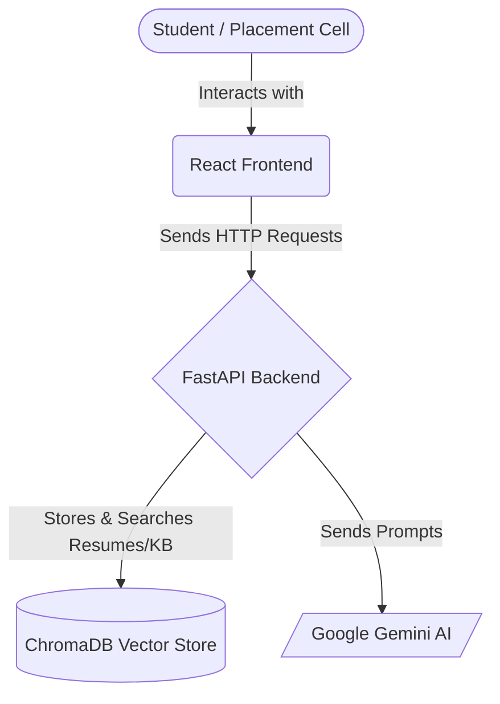
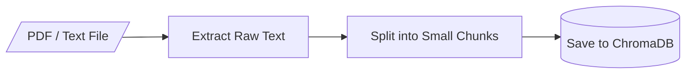
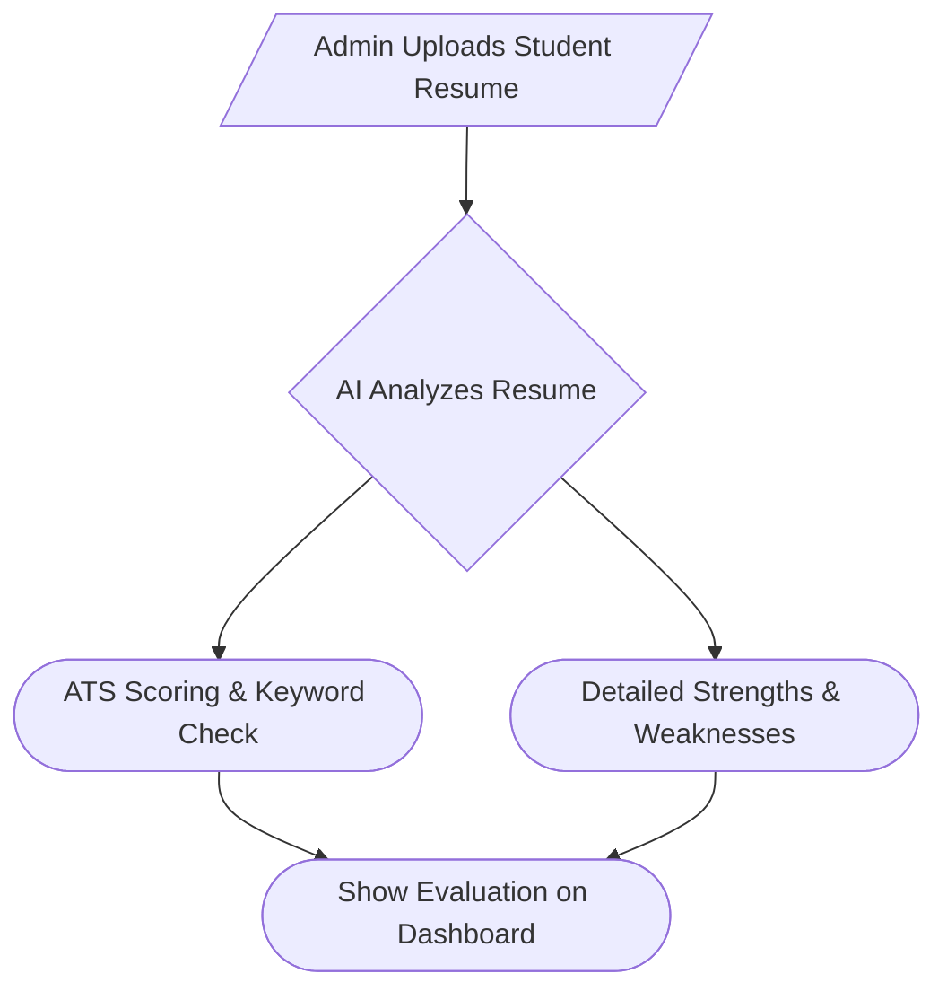
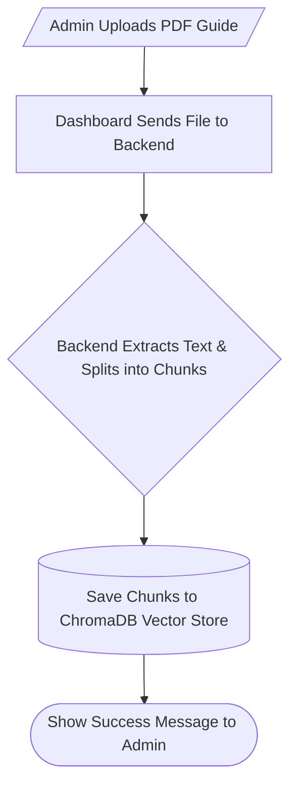
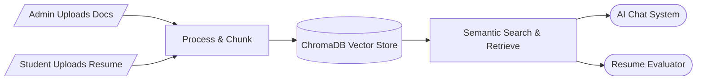

# 🎓 PlaceAI — Placement & Career Guidance Platform

PlaceAI is an intelligent platform designed to help students with their placement preparations and provide the placement cell with easy management tools. 

The project is structured to be straightforward and easy to understand. Below are the key components and how they work together, visualized through simple diagrams. You can use these points to easily explain the project to anyone.

---

## 1. Architecture

This diagram shows how the main technologies in the project connect to each other.

* **React Frontend:** The user interface where students and admins click buttons and chat. It's built for simplicity and runs in the browser.
* **FastAPI Backend:** The engine of the application. It receives requests from the frontend, coordinates tasks, and sends data back securely.
* **ChromaDB:** A special database that stores text as "vectors" (mathematical representations). This allows the system to perform *semantic searches* (finding text with similar meanings, not just exact keywords).
* **Google Gemini AI:** The brain of the platform that generates the smart, human-like text responses for career guidance and resume analysis.

---

## 2. Document Ingestion (How Data is Saved)

When a student uploads a resume or an admin uploads a placement guide, the system needs to process it so the AI can read and understand it later.

* **Extract Raw Text:** The system uses a PDF reader to grab all the plain text from the uploaded file, stripping away the images and formatting.
* **Split into Small Chunks:** Instead of feeding a huge document to the AI all at once, the text is broken down into smaller pieces (chunks). This makes it much faster and more accurate for the database to search through later.
* **Save to ChromaDB:** These chunks are saved into the vector database so they can be quickly retrieved whenever a student asks a relevant question.

---

## 3. The AI Chat Workflow

When a student asks a question in the chat, the system doesn't just blindly send it to the AI. It follows a structured, smart path.

* **Fetch Resume & Knowledge Base:** Before answering, the system securely grabs the student's resume and relevant placement materials from the database. This gives the AI the personal *context* it needs to give accurate advice.
* **What is the Goal?:** Depending on what the student wants, the system routes the question to a specialized "Node" (a specific instruction set for the AI).
* **Nodes (Mentor, Interview):** Each node gives the AI a different persona and set of rules. For example, the Interview Coach Node is told to act like a strict technical interviewer.
* **Generate Answer:** The AI combines the student's question, the retrieved context, and its specific persona instructions to generate a highly personalized response.

---
---

## 4. Placement Cell Resume Evaluation

The platform allows the placement cell to automatically evaluate student resumes against industry standards, giving them instant insights into student readiness.

* **Automated Scoring:** The AI scans the uploaded resume just like an Applicant Tracking System (ATS), checking for crucial keywords and proper formatting.
* **Instant Feedback:** It generates a detailed report highlighting what the student did well and what areas (like missing skills or vague descriptions) need improvement before actual company placements.
* **Dashboard View:** Admins can see this evaluation immediately on their dashboard, helping them identify which students need the most help.

---

## 5. Placement Cell Admin Workflow

The platform features a dedicated Admin Dashboard that empowers the placement cell to manage institutional data dynamically.

* **Dynamic Uploads:** Admins can drag and drop PDFs, placement policies, and sample resumes straight into the dashboard interface.
* **Instant Processing:** The backend automatically reads the file, breaks it into searchable chunks, and saves it into the vector database (ChromaDB) in real-time.
* **Immediate Availability:** As soon as a document is uploaded, the AI begins using that new information to answer student questions without requiring any system restarts or manual developer updates.

---

## 6. Data Ingestion vs. Retrieval Summary

To clarify how data flows in and out of the vector database (ChromaDB), here is a summary of exactly where ingestion and retrieval occur:

### 📥 Where Data Ingestion Happens (Saving to Database)
Data ingestion is the process of extracting text from files, splitting it into chunks, and saving it to ChromaDB. This happens in two main places:
* **Placement Cell Admin Dashboard:** When an admin uploads institutional documents (like placement policies, interview guides, or company rules).
* **Student Resume Upload:** When a student uploads their personal resume so the system can evaluate it or use it for personalized chat context.

### 📤 Where Data Retrieval Happens (Fetching from Database)
Data retrieval is the process of searching ChromaDB for the most relevant information to help the AI. This happens in:
* **The AI Chat Workflow:** Every time a student asks a question in the chat, the system searches the database to retrieve relevant placement guidelines and the student's own resume. This provides the AI with the factual *context* it needs to give accurate advice.
* **Resume Evaluation Workflow:** When the system automatically scores a student's resume, it retrieves industry standards or specific job criteria from the knowledge base to compare against the student's profile.
