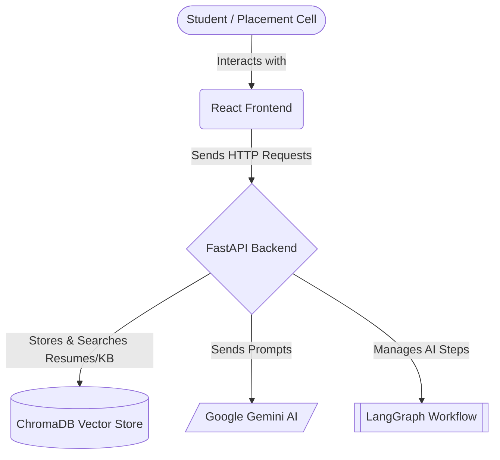
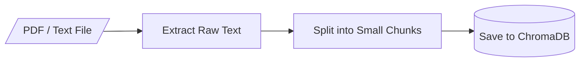
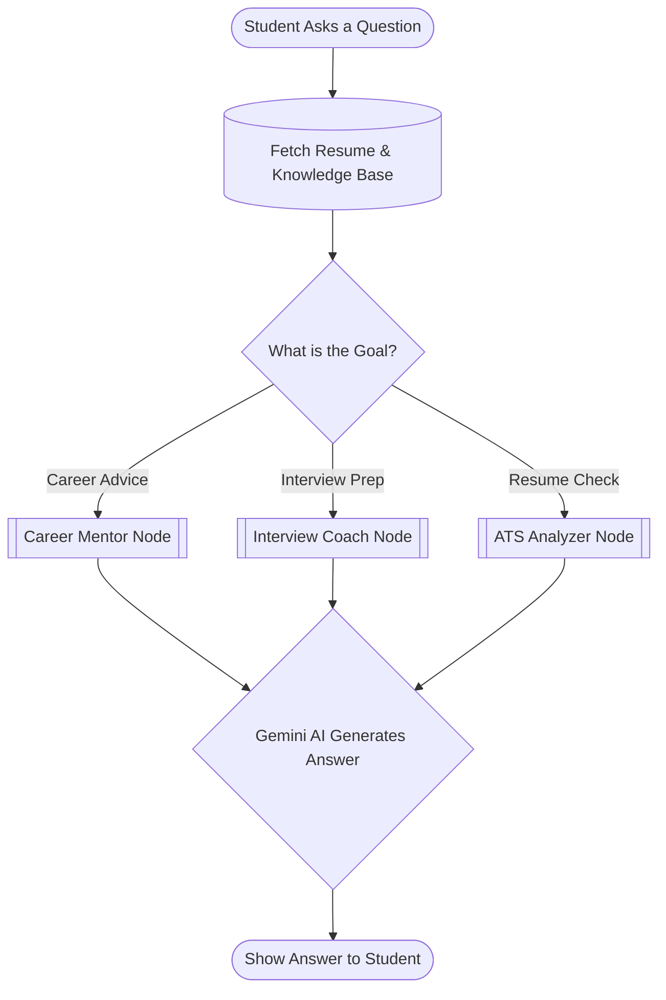
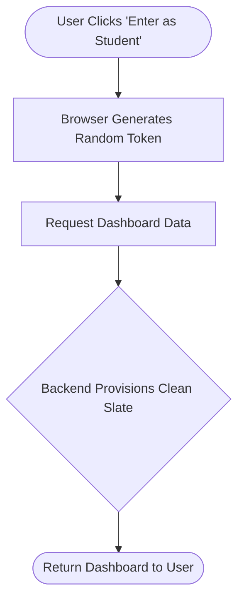
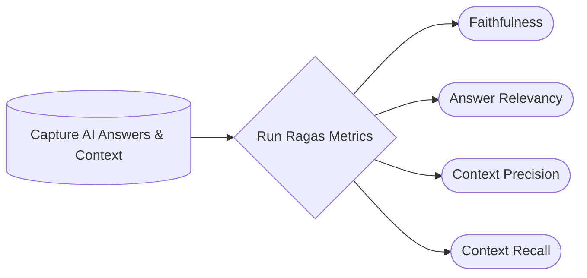

# 🎓 PlaceAI — Placement & Career Guidance Platform

PlaceAI is an intelligent platform designed to help students with their placement preparations and provide the placement cell with easy management tools. 

The project is structured to be straightforward and easy to understand. Below are the key components and how they work together, visualized through simple diagrams. You can use these points to easily explain the project to anyone.

---

## 1. High-Level Architecture

This diagram shows how the main technologies in the project connect to each other.

### How to explain this:
* **React Frontend:** The user interface where students and admins click buttons and chat. It's built for simplicity and runs in the browser.
* **FastAPI Backend:** The engine of the application. It receives requests from the frontend, coordinates tasks, and sends data back securely.
* **ChromaDB:** A special database that stores text as "vectors" (mathematical representations). This allows the system to perform *semantic searches* (finding text with similar meanings, not just exact keywords).
* **Google Gemini AI:** The brain of the platform that generates the smart, human-like text responses for career guidance and resume analysis.

---

## 2. Document Ingestion (How Data is Saved)

When a student uploads a resume or an admin uploads a placement guide, the system needs to process it so the AI can read and understand it later.

### How to explain this:
* **Extract Raw Text:** The system uses a PDF reader to grab all the plain text from the uploaded file, stripping away the images and formatting.
* **Split into Small Chunks:** Instead of feeding a huge document to the AI all at once, the text is broken down into smaller pieces (chunks). This makes it much faster and more accurate for the database to search through later.
* **Save to ChromaDB:** These chunks are saved into the vector database so they can be quickly retrieved whenever a student asks a relevant question.

---

## 3. The AI Chat Workflow

When a student asks a question in the chat, the system doesn't just blindly send it to the AI. It follows a structured, smart path.

### How to explain this:
* **Fetch Resume & Knowledge Base:** Before answering, the system securely grabs the student's resume and relevant placement materials from the database. This gives the AI the personal *context* it needs to give accurate advice.
* **What is the Goal?:** Depending on what the student wants, the system routes the question to a specialized "Node" (a specific instruction set for the AI).
* **Nodes (Mentor, Interview, ATS):** Each node gives the AI a different persona and set of rules. For example, the Interview Coach Node is told to act like a strict technical interviewer.
* **Generate Answer:** The AI combines the student's question, the retrieved context, and its specific persona instructions to generate a highly personalized response.

---

## 4. Access & Session Management

To make the platform easy to use for demonstrations, the traditional login system has been simplified.

### How to explain this:
* **Auth-Free Demo Mode:** There are no complex passwords. Users simply click a button to enter the application immediately.
* **Per-Tab Isolation:** The system uses browser storage in a way that treats every single browser tab as a completely different user. If you open a new tab, you get a fresh, blank session with no old data left over. This is perfect for testing different scenarios from a clean slate.

---

## 5. AI System Evaluation (Ragas Framework)

To ensure the AI gives accurate and reliable advice, the system's responses are evaluated using the **Ragas** framework.

### How to explain this:
* **Capture Data:** When the AI answers a question, the system logs the student's question, the resume/guides retrieved from the database, and the AI's final answer.
* **Faithfulness:** This checks if the AI's answer is based *strictly* on the provided context, ensuring it doesn't hallucinate or make up facts.
* **Answer Relevancy:** This ensures the AI actually addressed the user's specific question instead of going off-topic.
* **Context Precision & Recall:** This measures the search database (ChromaDB) performance. It checks if the system retrieved the *most useful* pieces of information and didn't miss any critical details from the knowledge base.

---

## 6. Placement Cell Admin Workflow

The platform features a dedicated Admin Dashboard that empowers the placement cell to manage institutional data dynamically.

### How to explain this:
* **Dynamic Uploads:** Admins can drag and drop PDFs, placement policies, and sample resumes straight into the dashboard interface.
* **Instant Processing:** The backend automatically reads the file, breaks it into searchable chunks, and saves it into the vector database (ChromaDB) in real-time.
* **Immediate Availability:** As soon as a document is uploaded, the AI begins using that new information to answer student questions without requiring any system restarts or manual developer updates.
