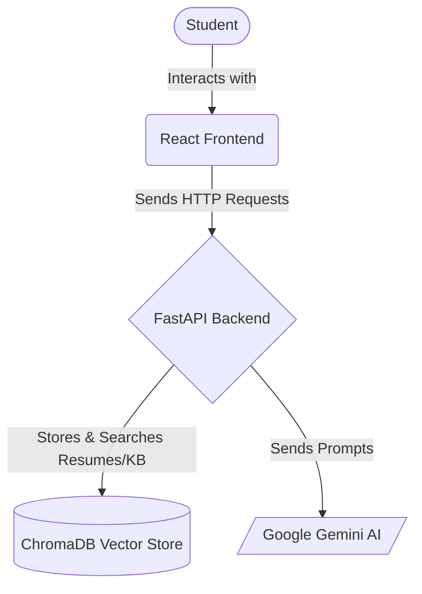
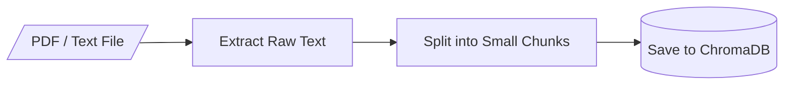
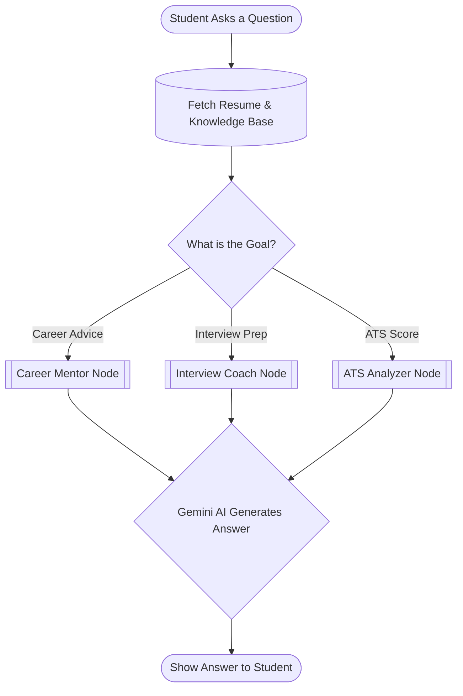
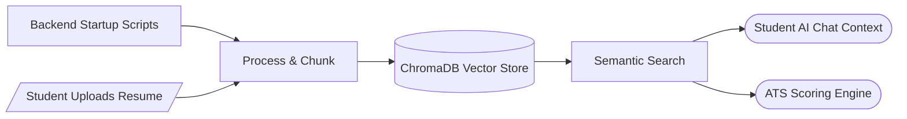
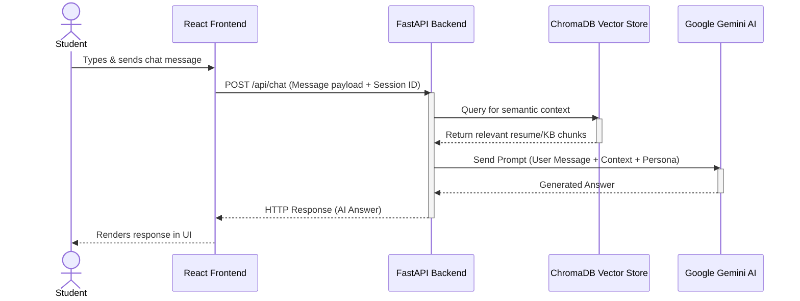
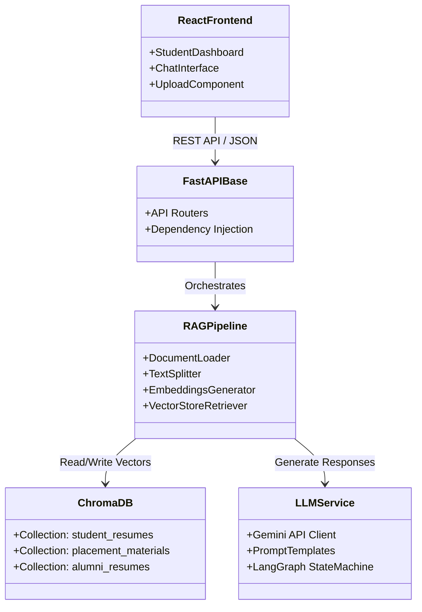
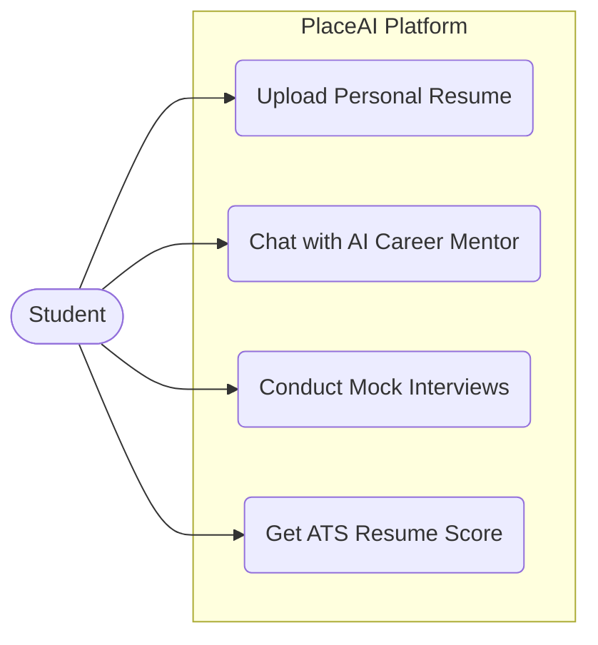

# 🎓 PlaceAI — AI Placement & Career Guidance Platform

PlaceAI is an intelligent, pure-RAG (Retrieval-Augmented Generation) platform designed to help students with their placement preparations. It acts as an AI Career Mentor that uses institutional knowledge (alumni resumes, interview experiences) and the student's own uploaded resume to provide highly personalized guidance.

This project is built as a stateless, frictionless demo environment focusing entirely on AI capabilities, without the overhead of user authentication or administrative dashboards.

---

## 1. Architecture

This diagram shows how the main technologies in the project connect to each other.

* **React Frontend:** The user interface where students click buttons and chat. It's built for simplicity and runs in the browser.
* **FastAPI Backend:** The engine of the application. It receives requests from the frontend, coordinates tasks, and sends data back securely.
* **ChromaDB:** A special database that stores text as "vectors" (mathematical representations). This allows the system to perform *semantic searches* (finding text with similar meanings, not just exact keywords).
* **Google Gemini AI / LangGraph:** The brain of the platform that generates the smart, human-like text responses for career guidance and resume analysis, orchestrated by a LangGraph state machine.

---

## 2. Document Ingestion (How Data is Saved)

When the backend starts, it automatically ingests institutional knowledge so the AI can read and understand it. When a student uploads a resume, the same process happens dynamically for their session.

* **Extract Raw Text:** The system uses a PDF reader to grab all the plain text from the uploaded file, stripping away the images and formatting.
* **Split into Small Chunks:** Instead of feeding a huge document to the AI all at once, the text is broken down into smaller pieces (chunks). This makes it much faster and more accurate for the database to search through later.
* **Save to ChromaDB:** These chunks are saved into the vector database so they can be quickly retrieved whenever a student asks a relevant question.

---

## 3. The AI Chat Workflow

When a student asks a question in the chat, the system doesn't just blindly send it to the AI. It follows a structured, smart path.

* **Fetch Resume & Knowledge Base:** Before answering, the system securely grabs the student's resume (tied to their temporary session) and relevant placement materials from the database. This gives the AI the personal *context* it needs to give accurate advice.
* **What is the Goal?:** Depending on what the student wants, the system routes the question to a specialized "Node" (a specific instruction set for the AI).
* **Nodes (Mentor, Interview, ATS):** Each node gives the AI a different persona and set of rules. For example, the Interview Coach Node is told to act like a strict technical interviewer.
* **Generate Answer:** The AI combines the student's question, the retrieved context, and its specific persona instructions to generate a highly personalized response.

---

## 4. Complete System Ingestion & Retrieval Flow

To see the big picture, here is exactly where data enters (Ingestion) and exits (Retrieval) the vector database across the entire platform.

### 📥 Where Data Ingestion Happens (Saving to Database)
* **Backend Startup:** Institutional documents, alumni PDFs, and interview experiences are loaded from the `data/` folders on server start.
* **Student Dashboard:** When students upload their personal resumes to the platform for their session.

### 📤 Where Data Retrieval Happens (Fetching from Database)
* **Student AI Chat:** When a student asks a question, the system retrieves the alumni guides and the student's own resume to provide the AI with accurate context.
* **ATS Scoring:** When the student clicks the ATS button, the system pulls only their resume chunks to evaluate format and keywords.

---

## 5. UML Diagrams

To provide a deeper technical understanding of the system's interactions and structure, here are the UML sequence and class diagrams.

### Sequence Diagram: AI Chat Workflow

This sequence diagram details the exact order of operations when a student interacts with the AI mentor.

### Class/Component Diagram: System Architecture

This diagram illustrates the main logical components of the platform and their dependencies.

### Use Case Diagram: User Interactions

This diagram highlights the distinct actions available to the primary actor of the system (the Student).

