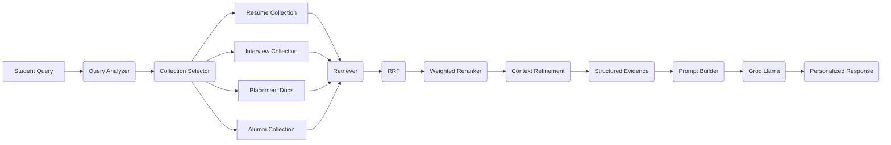
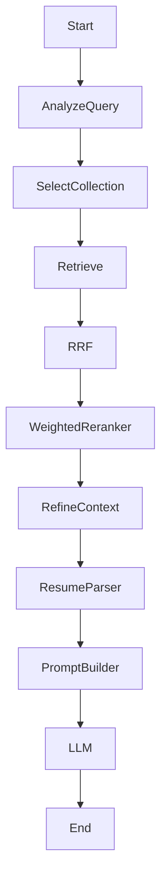
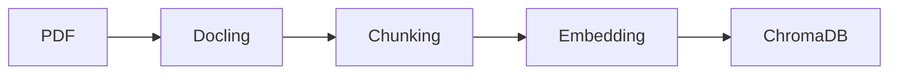
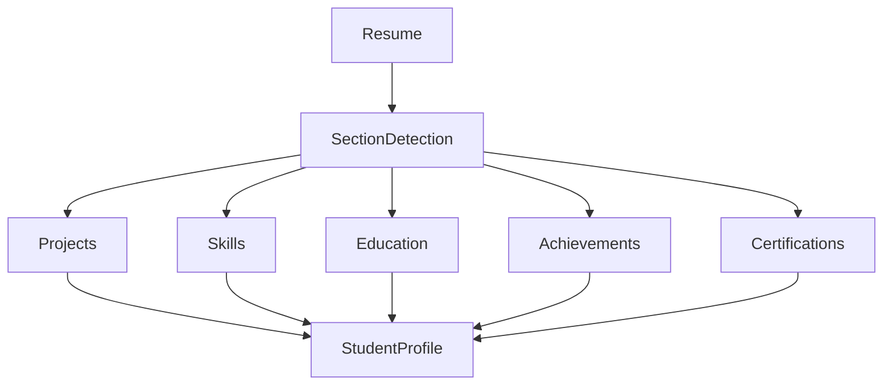
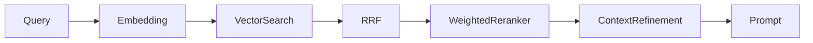
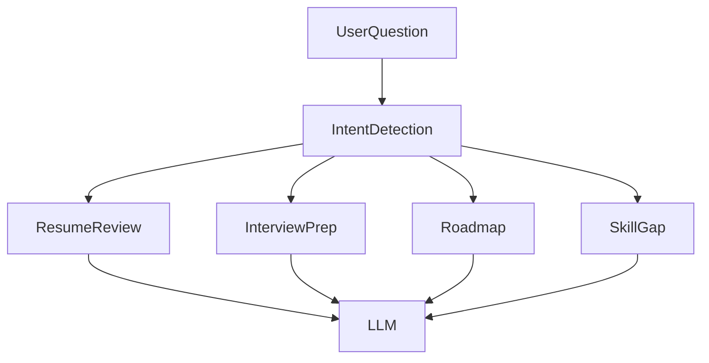

# 🧠 PlaceAI - Agentic RAG Placement Mentor

---

## Overall Workflow

| Traditional ChatGPT | PlaceAI |
|--------------------|---------|
| Generic Answers | Personalized Guidance |
| No Resume Understanding | Resume Parsing |
| No Institution Knowledge | Uses Placement Database |
| Hallucinates | Grounded on RAG |
| Fixed Workflow | Agentic Workflow |
## ⭐ STAR

### Situation

Placement information was scattered across resumes, interview experiences, and reports, making personalized guidance difficult.

### Task

Develop an AI Placement Mentor capable of understanding student profiles and institutional placement data.

### Action

Built an Agentic RAG system using LangGraph, ChromaDB, Docling, BGE embeddings, custom Weighted Reranker, Resume Parser, and Dynamic Mentor.

### Result

Successfully generated personalized resume reviews, skill-gap analysis, interview preparation, and career roadmaps grounded in institutional knowledge.
Frontend

React

Backend

FastAPI

Workflow

LangGraph

Framework

LangChain

Parser

Docling

Embeddings

BGE

Vector DB

ChromaDB

LLM

Groq Llama 3.3

Fallback

Gemini

Language

Python