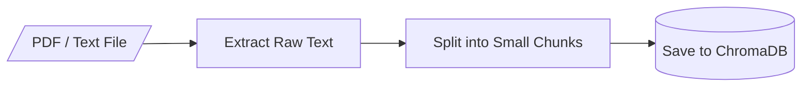
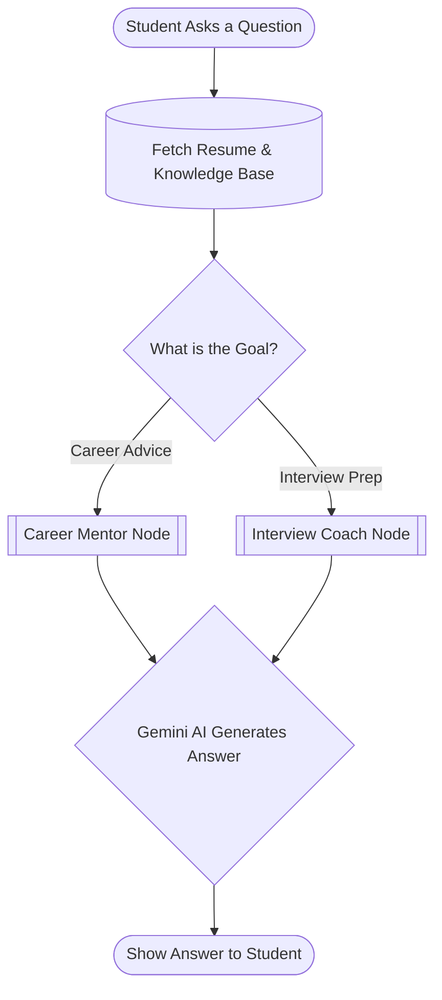
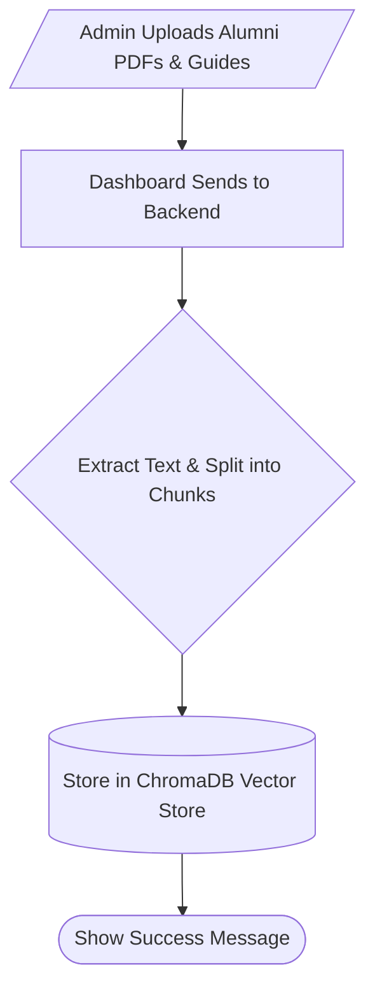
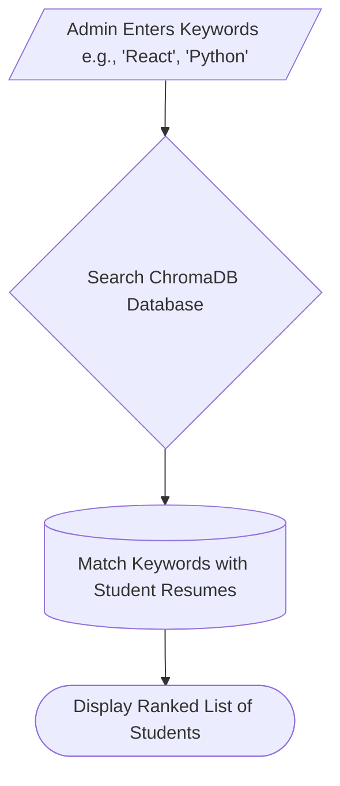
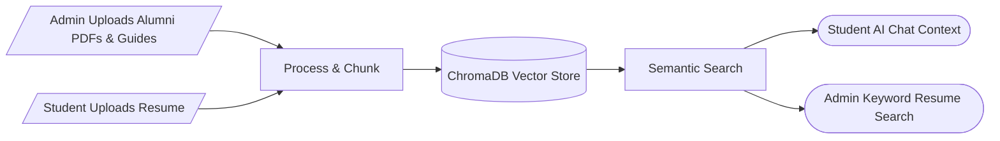

# 🎓 PlaceAI — Placement & Career Guidance Platform

PlaceAI is an intelligent platform designed to help students with their placement preparations and provide the placement cell with easy management tools. 

The project is structured to be straightforward and easy to understand. Below are the key components and how they work together, visualized through simple diagrams. You can use these points to easily explain the project to anyone.

---

## 1. Architecture

This diagram shows how the main technologies in the project connect to each other.

* **React Frontend:** The user interface where students and admins click buttons and chat. It's built for simplicity and runs in the browser.
* **FastAPI Backend:** The engine of the application. It receives requests from the frontend, coordinates tasks, and sends data back securely.
* **ChromaDB:** A special database that stores text as "vectors" (mathematical representations). This allows the system to perform *semantic searches* (finding text with similar meanings, not just exact keywords).
* **Google Gemini AI:** The brain of the platform that generates the smart, human-like text responses for career guidance and resume analysis.

---

## 2. Document Ingestion (How Data is Saved)

When a student uploads a resume or an admin uploads a placement guide, the system needs to process it so the AI can read and understand it later.

* **Extract Raw Text:** The system uses a PDF reader to grab all the plain text from the uploaded file, stripping away the images and formatting.
* **Split into Small Chunks:** Instead of feeding a huge document to the AI all at once, the text is broken down into smaller pieces (chunks). This makes it much faster and more accurate for the database to search through later.
* **Save to ChromaDB:** These chunks are saved into the vector database so they can be quickly retrieved whenever a student asks a relevant question.

---

## 3. The AI Chat Workflow

When a student asks a question in the chat, the system doesn't just blindly send it to the AI. It follows a structured, smart path.

* **Fetch Resume & Knowledge Base:** Before answering, the system securely grabs the student's resume and relevant placement materials from the database. This gives the AI the personal *context* it needs to give accurate advice.
* **What is the Goal?:** Depending on what the student wants, the system routes the question to a specialized "Node" (a specific instruction set for the AI).
* **Nodes (Mentor, Interview):** Each node gives the AI a different persona and set of rules. For example, the Interview Coach Node is told to act like a strict technical interviewer.
* **Generate Answer:** The AI combines the student's question, the retrieved context, and its specific persona instructions to generate a highly personalized response.

---
---

## 4. Institutional Knowledge Management

The placement cell can easily upload and manage institutional knowledge, such as alumni interview experiences, company guidelines, and placement policies.

* **Alumni Experiences & Guides:** Admins can drag and drop PDFs containing valuable past interview experiences or company-specific preparation guides.
* **Automated Processing:** The system automatically extracts the text and breaks it into smaller chunks for efficient searching.
* **Persistent Storage:** These chunks are saved into the ChromaDB vector store, instantly becoming part of the AI's knowledge base to help future students.

---

## 5. Keyword-Based Resume Search

The platform empowers the placement cell to quickly find specific student candidates based on industry keywords.

* **Targeted Search:** When a company requests students with specific skills (e.g., "Data Science" or "React"), the admin can simply search for these keywords.
* **Vector Matching:** The system queries the ChromaDB vector store to find resumes that closely match the requested skills.
* **Efficient Shortlisting:** The admin instantly receives a ranked list of relevant student profiles, saving hours of manual resume screening.

---

## 6. Complete System Ingestion & Retrieval Flow

To see the big picture, here is exactly where data enters (Ingestion) and exits (Retrieval) the vector database across the entire platform.

### 📥 Where Data Ingestion Happens (Saving to Database)
* **Placement Cell Dashboard:** When admins upload institutional documents, alumni PDFs, and interview experiences.
* **Student Dashboard:** When students upload their personal resumes to the platform.

### 📤 Where Data Retrieval Happens (Fetching from Database)
* **Student AI Chat:** When a student asks a question, the system retrieves the alumni guides and the student's own resume to provide the AI with accurate context.
* **Admin Resume Search:** When the placement cell admin searches for specific keywords to shortlist candidates for upcoming company drives.
